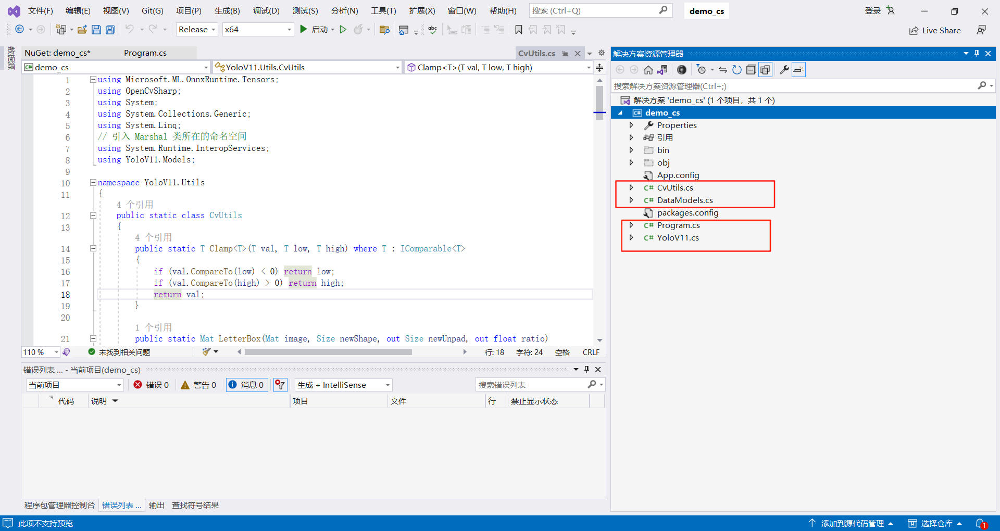
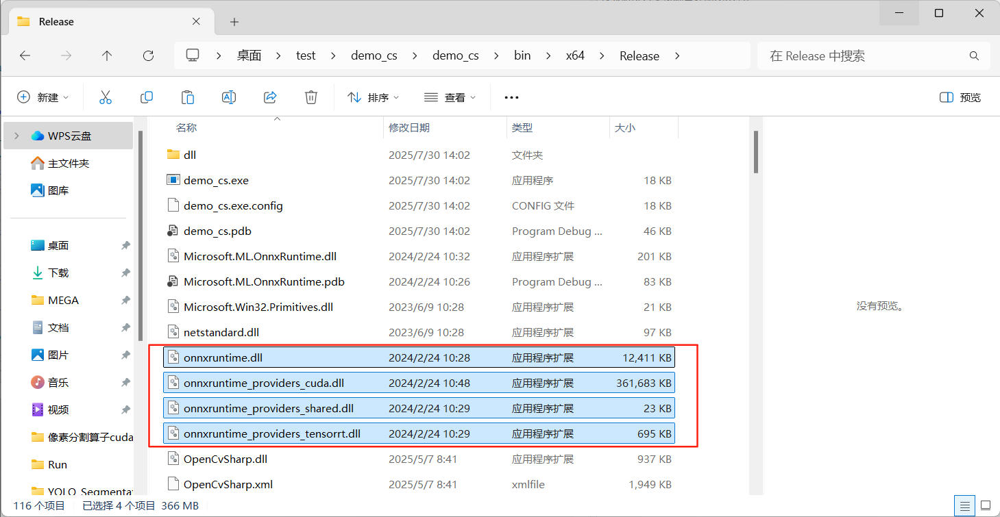

# 基于yolo的目标定位和像素分割使用文档
## 1. 环境配置
支持的操作系统：Windows10/11 X64
**此项目只支持在Nvidia显卡上运行。不支持AMD等其他品牌，否则只能使用cpu进行预测**
**如果只想使用cpu进行推测，不需要安装显卡驱动、cuda工具包、cudnn**
1. 使用cuda的依赖
   1. 显卡驱动下载：若电脑在此前从未安装过相应的驱动，需先安装显卡驱动，英伟达显卡驱动[官方下载连接](https://www.nvidia.com/en-us/software/nvidia-app/)。
   2. cuda工具包下载：在安装前现在命令台输入("nvidia-smi.exe")查询**最高支持**的cuda version（就只是最高而已，不需要一定下载这个，强烈建议就只下载cuda11.7），如图所示：
   
   在cuda工具包[下载链接](https://nbai-cloud-3-0.oss-ap-southeast-1.aliyuncs.com/yolo-sdk/dependencies/cuda_11.7.1_516.94_windows.exe)下载后安装。(如果是win10的电脑需从官网下载，[下载链接](https://developer.nvidia.com/cuda-11-7-1-download-archive?target_os=Windows&target_arch=x86_64&target_version=10&target_type=exe_local))
   3. cuDNN下载：[下载链接](https://nbai-cloud-3-0.oss-ap-southeast-1.aliyuncs.com/yolo-sdk/dependencies/cudnn-windows-x86_64-8.5.0.96_cuda11-archive.zip)下载完成后解压
   
   进入解压完的文件夹，复制"bin"、"include"、"lib"这三个文件夹
   
   打开“C:\Program Files\NVIDIA GPU Computing Toolkit\CUDA”里面有你安装的对应的cuda工具包版本，再打开这个文件夹。
   
   
   将cuDNN中复制的三个文件夹粘贴进此文件夹。粘贴完后进入"bin"中应该可以看到里面包含cudnn
   
2. 环境依赖：Visual Stdio 2017版本及以上（建议安装Visual Stdio 2022），Visual Stdio[下载链接](https://visualstudio.microsoft.com/zh-hans/downloads/)。在官网下载号Visual Stdio后进行安装，注意勾选“.Net桌面开发”和“通用Windows平台开发”。
   1. 如果您已经下载VS软件：
       1. 请在“工具”-“获取工具和功能”中下载安装包
        
       2. 在“工作负荷”中，勾选“.Net桌面开发”和“通用Windows平台开发”，然后点击“修改”。
        
       3. 在"单个组件"中，勾选".Net Framework4.6.1 SDK"和".NET Framework4.6.1"目标包。然后点击修改
        
## 2. 快速使用
1. 新建项目
   1. 打开visual stdio，点击"创建新项目"
   
   2. 选择"C#"、"Windows"、"控制台"，然后点击"下一步"
   
   3. 在"框架"中，选择".NET Framework 4.6.1",项目名称为"demo_cs"，点击创建
   
2. 修改运行配置
   1. 在红框中勾选"Release"
   
   2. 在"Any CPU"处，点击"配置管理器"
   
   3. 点击图中红框内下拉菜单，选择"新建"
   
   4. 选择"x64"
   
   5. 最终效果为
   
3. 添加Nuget包
   1. 右键"解决方案资源管理器"中的"demo_cs",点击"管理NuGet程序包"
   
   2. 添加"openCVsharp4.win"和"Microsoft.ML.OnnxRuntime.Gpu"，其中"Microsoft.ML.OnnxRuntime.Gpu"的版本需要选择1.17.1
   
   
4. 修改代码
   1. 在"解决资源管理器"中，右键，点击"在文件资源管理器中打开文件夹"。
   
   2. 打开此"readme"下的"code"文件夹，将其中的所有文件复制粘贴到上一步的"在文件资源管理器中打开文件夹"的目录中
   
   
   3. 返回Visual Stdio中,在"解决方案资源管理器"中，点击"显示所有文件"，依次右键"CvUtils.cs"、"DataModels.cs"、"YoloV11.cs"这三个，"包含在项目中"
   
   
   4. "修改Program.cs"中的modelPath、labelsPath、datasetDir、resultDir、useGpu
      1. modelPath是模型文件的路径
      2. labelsPath是标签路径（即names.txt）的路径
      3. datasetDir是待检测图片的路径
      4. resultDir是检测完图片保存图片的路径
      5. useGpu是是否使用cuda进行推测（如果最开始没有安装cuda工具包和cudnn只能选false）
    
5. 编译
   1. 点击"生成"-生成解决方案
   
   
   2. 在"解决资源管理器"中，右键，点击"在文件资源管理器中打开文件夹"，点击上一级，点击"packages"-"Microsoft.ML.OnnxRuntime.Gpu.Windows.1.17.1"-"runtimes"-"win-x64"-"native",复制其中所有的.dll文件
   
   
   
   3. 返回Visual Stdio，在"解决资源管理器"中，右键，点击"在文件资源管理器中打开文件夹"，打开"bin"-"x64"-"Release"，粘贴进此文件夹中。
   
   

6. 返回Visual Stdio中，点击"调试"-"开始执行不调试"

